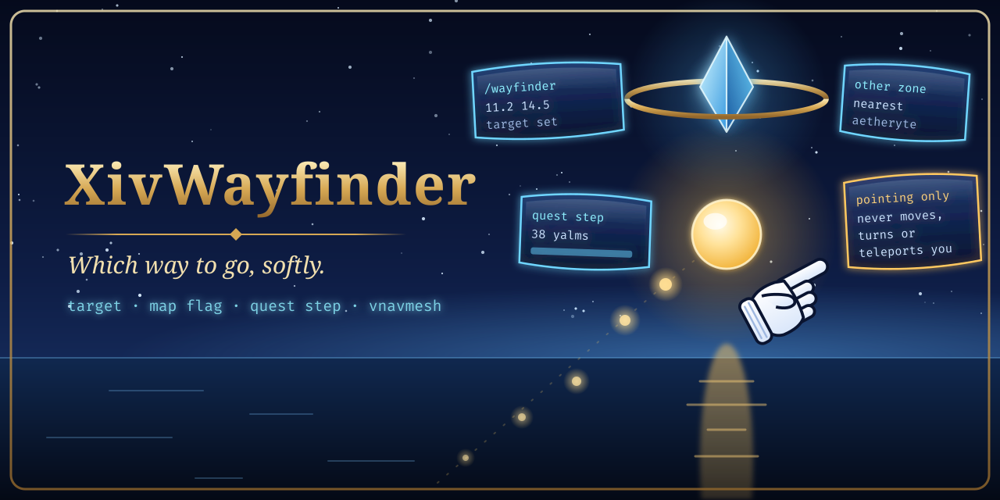

# XivWayfinder

<p align="center">
  <picture>
    <source media="(prefers-color-scheme: dark)" srcset="images/readme/hero-dark.png">
    <source media="(prefers-color-scheme: light)" srcset="images/readme/hero-light.png">
    
  </picture>
</p>


**[Site](https://spacegho.st/mods/ffxiv/xivwayfinder/) · [Install](https://spacegho.st/mods/ffxiv/plugins/) · [Vote on what's next](https://spacegho.st/mods/ffxiv/xivwayfinder/vote/) · [Screenshots](https://spacegho.st/mods/ffxiv/term/gallery/?mod=xivwayfinder) · [Changelog](CHANGELOG.md)**

**Which way to go, softly: a glowing bead and the classic pointing glove, in FINAL FANTASY XIV.**

XivWayfinder is a Dalamud plugin that draws a softly pulsing bead a couple of yalms ahead of your character in the
direction you need to head, and the game's own white pointing glove beside it, sliding to the edge of the screen
and pointing there when the way lies behind you. It follows a target you set (`/wayfinder 11.2 14.5`), your map
flag, or your tracked quest's next step, and names the nearest aetheryte when the target is in another zone.
With [vnavmesh](https://github.com/awgil/ffxiv_navmesh) installed it points along the walkable path instead of
through walls.

> **Pointing only.** XivWayfinder never moves, turns or teleports your character, and never asks vnavmesh to.

> **Status: experimental, not verified in game.** Host tests cover the direction and angle maths, the
> screen-edge clamping, the glove's placement and mirroring, the minion glove's placement, turning and tilt, the
> path trail's sampling along the route, the target priority, the pulse and tap timing, the command and IPC
> parsing and the state JSON. Nothing has been observed in the game yet: not the drawing, not the minion glove's
> client-side model, not the flag, quest and aetheryte reads, not vnavmesh. What follows is implemented intent. `/wayfinder test` puts a
> target 20 yalms ahead of you to prove it; [docs/WAYFINDER.md](docs/WAYFINDER.md#proving-it-in-game) lists
> what to look for.

[Install](#install-dev-plugin) · [Commands](#commands) · [Settings](#settings) · [For other plugins](#for-other-plugins) ·
[Full guide](docs/WAYFINDER.md) · [IPC](docs/IPC.md)

## What you get

- **The bead**: floats 1.5 to 3 yalms ahead of you at chest height, bobbing, with a breathing glow. It dims as
  you face the right way and brightens as you turn away, so a glance says whether you are on course.
- **The glove**: the white pointing-hand cursor from the game's own files (`ui/uld/Cursor.tex`), read at run
  time, never copied into this repository. Near your character while the way is on screen, clamped to the screen
  edge and pointing when it is not, with a little tap. Without that texture, XivWayfinder draws an original glove of
  its own. Choose **bead**, **glove** or **both**.
- **The minion glove** (`/wayfinder minion`, not the default): the game's own 3D model of the *Wind-up Cursor*
  minion, the white pointing glove, floating beside the bead and turning to point the way, tilting up and down
  slopes. It is a client-side model only you see, found in your game data by name at run time: never a summoned
  minion, never shipped with the plugin, nothing sent to the server. The flat glove still points from the screen
  edge when the way is off screen. Untested in game.
- **Path highlighting**: with vnavmesh, a trail of beads and a soft line laid along the walkable route ahead of
  you, fixed to the ground so you walk past them, not a line as the crow flies. Without a path it is a straight
  dotted line and says so. The distance in yalms on hover or always, a soft ring when you arrive.
- For a target in another zone: *Teleport to (aetheryte)* instead of an arrow, attuned aetherytes first.
- Steps aside in cutscenes, zone changes, group pose and with the UI hidden; in combat and duties too unless you
  say otherwise.

## Requirements

- FFXIV with Dalamud (API 15). Linux under Wine and Windows alike; nothing here is platform-specific.
- Optional: vnavmesh, for walkable paths.

## Install (from the plugin repository)

```text
https://spacegho.st/mods/ffxiv/plugins.json
```

1. `/xlsettings` → **Experimental** → **Custom Plugin Repositories**: add the URL, **+**, save.
2. In the same tab, tick **Get plugin testing builds**: XivWayfinder has test builds only so far.
3. `/xlplugins` → **All Plugins**: search **XivWayfinder** and install it.

## Install (dev plugin)

```sh
git clone https://github.com/Spaceghost/xivwayfinder-dalamud.git
cd xivwayfinder-dalamud
tools/fetch-dalamud.sh && tools/install-dev.sh
```

`tools/install-dev.sh` builds Release and stages the plugin beside the checkout at
`../xiv-wayfinder-build/devplugin/`, then prints the Wine path. Add it under `/xlsettings` → **Experimental** →
**Dev Plugin Locations**, then enable **XivWayfinder** under `/xlplugins` → **Dev Tools**. The script does not edit
Dalamud's configuration. `XIVWAYFINDER_ARTIFACTS` and `XIVWAYFINDER_STAGE` override the output folders.

## Commands

| Command | What it does |
| --- | --- |
| `/wayfinder` | Opens the settings. |
| `/wayfinder X Y [zone]` | Points at map coordinates: `11.2 14.5`, `(11.2, 14.5)`, `X: 11.2 Y: 14.5`, `21.5 22.1 central shroud`. |
| `/wayfinder clear` | Forgets that target. |
| `/wayfinder test [yalms]` | A target 20 yalms straight ahead: the quickest way to see it work. |
| `/wayfinder auto` · `target` · `flag` · `quest` | Follow everything by priority, or one source only. |
| `/wayfinder bead` · `glove` · `both` · `minion` | The pointer's look; `minion` is the Wind-up Cursor model. |
| `/wayfinder on` · `off` · `status` | Show, hide, or say what it is doing. |

`/xivwayfinder` is the same command under the plugin's full name.

## Settings

What to follow and in which order (target, flag, quest), the aetheryte hint, bead or glove or both or the minion
glove (and where it floats, its size, a turn correction and tilting), the game's glove or the drawn one, the bead's
distance, height, size and colour, the glove's size, the trail (on by default) and whether it follows a path or a
straight line, the distance readout, the arrival radius, hiding in combat and duties, and vnavmesh. The window's first line always says what
is being pointed at and, when nothing shows, why. Details: [docs/WAYFINDER.md](docs/WAYFINDER.md).

## For other plugins

Four IPC functions, no assembly reference needed. Full rules and the JSON: [docs/IPC.md](docs/IPC.md).

| Name | Signature | Meaning |
| --- | --- | --- |
| `XivWayfinder.v1.SetTarget` | `uint territoryId, float x, float z, string label → bool` | Point at world X/Z; territory 0 is the current one. |
| `XivWayfinder.v1.SetMapTarget` | `uint territoryId, float mapX, float mapY, string label → bool` | The same in map coordinates, as the game prints them. |
| `XivWayfinder.v1.Clear` | `→ bool` | Forget that target. |
| `XivWayfinder.v1.GetState` | `→ string` | JSON: source, target, zone, distance, aetheryte, why hidden. |

## Privacy and security

XivWayfinder talks to nothing on the network and writes nothing but its own settings. It reads the game's own UI
files for the glove picture, the game's sheets for zones, maps, aetherytes and the Wind-up Cursor minion, and the
journal, flag and map markers from game memory; it changes none of them. With the minion glove chosen it creates
one object of its own in the game's client-side object list (as Brio and Ktisis do for theirs), moves it, and
deletes it again; that object exists only in your game's memory.

## Development

```sh
tools/fetch-dalamud.sh                               # Dalamud reference assemblies
dotnet test tests/XivWayfinder.Core.Tests -c Release
dotnet build src/XivWayfinder.Plugin/XivWayfinder.Plugin.csproj -c Release && tools/package.sh
```

`XivWayfinder.Core` holds everything that can be tested without the game (BCL only); the plugin project holds the
Dalamud glue. `master` is the only branch. Every user-visible change edits `changelog.json`
(`tools/changelog.py` renders `CHANGELOG.md`); statuses mean: `new`/`fix` seen working in game, `beta` merged but
not verified in game, `next` still being built. Releasing: [docs/RELEASING.md](docs/RELEASING.md).
